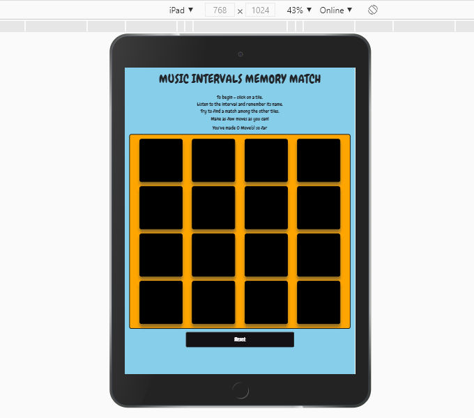

# MUSIC INTERVALS MEMORY MATCH

[view and play the game here](https://garyburke888.github.io/Music-Intervals-Memory-Match)

## A basic memory game with an added audio feature.

The main purpose of this game to help young music students have fun while learning music Intervals. The game consists of 16 tiles, which are 8 sets of matching pairs. It's a version of the popular game 'Concentration'. At the beginning of the game all of the tiles are blanked out. Two tiles are flipped over on each turn. The object of the game is to turn over pairs of matching tiles. In this version of the game the tiles are named after a music interval (Unison, Major 2nd, Major 3rd, Perfect 4th etc.) and when clicked, will also play that music interval as a learning mechanism. 

Over the course of the game, it becomes known where certain tiles are located, and so upon turning up one tile, players with good memory will be able to remember where they have already seen its pair. The player aims to match all the pairs in as little moves as possible. Once they finish the game, they get an option to play again.

# USER EXPERIENCE (UX)

## USER STORIES:

## - FIRST TIME USER GOALS
* As a first time user, I want to quickly understand how to play the game.
* As a first time user, I want to have fun playing the game, and learn something new.
* As a first time user, I want to know this will help me teach students music intervals.

## - RETURNING USER GOALS
* As a returning user, I want to get better at playing the game.
* As a returning user, I want to progress to more difficult levels.
* As a returning user, I want to share the game with more students.

## - FREQUENT USER GOALS
* As a frequent user, I want to enhance my ability to recognise music intervals.
* As a frequent user, I want to get better at playing the game.
* As a frequent user, I want to rely on this game as a teaching tool.

# DESIGN

## - COLOUR SCHEME

* The two main colours are blue and orange.
* Game tiles are black when hidden, blue when active, green when matched and temporarily red when not matched.
* Main headings and text are black.
* Buttons are black, with white text.

## - Fonts

* Google Fonts - Chewy.

## - Images

* All tiles are .png files.
* No background images are used, so as not to distract from the game board in any way.

# FEATURES

* Responsive on all devices
* Interactive elements

# TECHNOLOGIES USED

* HTML
* CSS
* JavaScript
* Bootstrap
* Jasmine
* GitHub
* GitPod
* Google Fonts
* Corel Paint Shop Pro (for custom images)
* Apple Logic Pro (for audio clips)
* EmailJS

# TESTING

* The W3C Markup Validator and W3C CSS Validator Services were used to ensure there were no fatal syntax errors.
* Game was tested on Chrome, Safari, Edge, Mozilla & Firefox browsers.
* Game was tested on various screens / sizes including desktop, laptop, iPhone & iPad.
* Game was forwarded to friends and family (including children) for feedback on user experience.
* Jasmine tests were also written and implemented [here](testing.html).

# DEPLOYMENT

* Game was developed using GitPod, committed to Git and pushed to GitHub.
* Game was deployed to GitHub Pages.

# FUTURE DEVELOPMENT PLANS

* Game could have more levels.
* Game could let users register a best score and try to beat it.
* Game could have beginner / inter / advanced versions.
* Game could have even more audio involved, victory music when matches are made and the opposite.

# CREDITS & ACKNOWLEDGEMENTS

* [Tutorial](https://scotch.io/tutorials/how-to-build-a-memory-matching-game-in-javascript)
* [Jasmine Testing](https://jasmine.github.io/2.0/introduction)
* Testing, design & development ideas - Code Institute
* Gerard McBride - Mentor
* Gary Burke - Designer