# MUSIC INTERVALS MEMORY MATCH

View and play the game [here](https://garyburke888.github.io/Music-Intervals-Memory-Match).

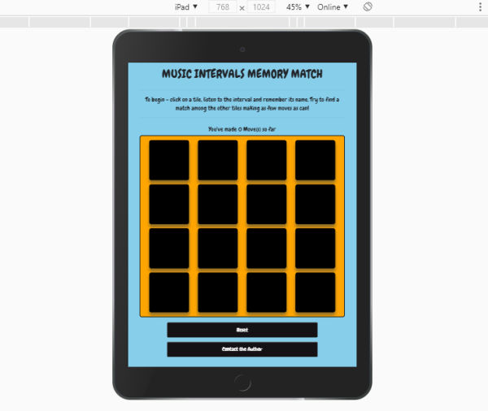

## A basic memory game with an added audio feature.

The main purpose of this game to help young music students have fun while learning music Intervals. The game consists of 16 tiles, which are 8 sets of matching pairs. It's a version of the popular game 'Concentration'. At the beginning of the game all of the tiles are blanked out. Two tiles are flipped over on each turn. The object of the game is to turn over pairs of matching tiles. In this version of the game the tiles are named after a music interval (Unison, Major 2nd, Major 3rd, Perfect 4th etc.) and when clicked, will also play that music interval as a learning mechanism. 

Over the course of the game, it becomes known where certain tiles are located, and so upon turning up one tile, players with good memory will be able to remember where they have already seen its pair. The player aims to match all the pairs in as little moves as possible. Once they finish the game, they get an option to play again.

# USER EXPERIENCE (UX)

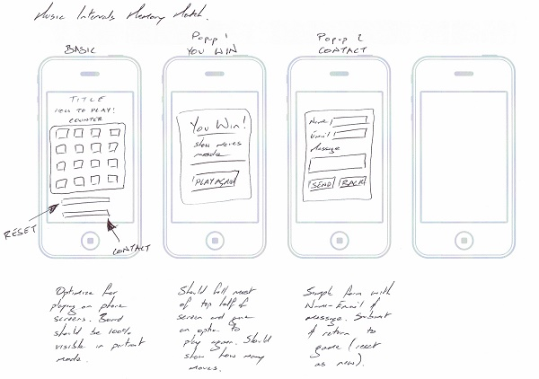
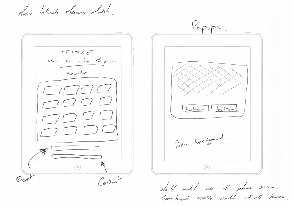

This game is for Music Teachers & Music Students, with the specific aim of helping to hear and recognise certain music intervals. As students play and try to win the game, they will hear music intervals that match their title on the tiles that are being clicked currently - for example a tile will have the title 'Perfect Fourth' and the student will hear a perfect fourth interval being played in the browser, and so on for all intervals.

## USER STORIES

### FIRST TIME USER GOALS:
* As a first time user, I want to play this game on my phone or tablet.
* As a first time user, I want to quickly understand how to play the game.
* As a first time user, I want to have fun playing the game, and learn something new.
* As a first time user, I want to know this will help me teach students music intervals.

### RETURNING USER GOALS:
* As a returning user, I want to get better at playing the game.
* As a returning user, I want to listen to the music intervals more closely.
* As a returning user, I want to share my views with the games creator.

### FREQUENT USER GOALS:
* As a frequent user, I want to enhance my or my students ability to recognise music intervals.
* As a frequent user, I want to win the game in less moves than before.
* As a frequent user, I want to rely on this game as a quick and easy teaching tool.

# DESIGN

### COLOUR SCHEME

* The two main colours are blue and orange.
* Game tiles are black when hidden, blue when active, green when matched and temporarily red when not matched.
* Main headings and text are black.
* Buttons are black, with white text.

### Fonts

* Google Fonts - Chewy.

### Images

* All tiles are .png files, used as part of the mechanism to make tiles seem hidden at the start of the game (where the background of each tile is set to the same colour as the image. Once tiles are clicked, the background colour changes to make the image visible).

### Audio

* All audio files are .mp3 which are widely supported in all main browsers (Safari, Chrome, Edge, Firefox and Opera).

# FEATURES

* __Responsive Design__ - Optimised for use on a phone or tablet.
* __Interactive__ - Users click on tiles to reveal titles and hear audio being played.
* __Audio__ - Each tile has an audio clip associated with it, as does matching tiles and winning the game.
* __Reset Button__ - Users can reset the gameboard to start again.
* __Move Counter__ - Users can count their moves so as to try and make as little moves as possible or try to beat their score the next time they play.
* __Popup Contact Form__ - Users can contact the author of the game, in the same window. Users can then return to the game.

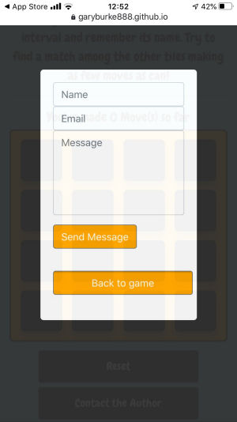

# TECHNOLOGIES USED

* __HTML__ - for basic design.
* __CSS__ - for styling.
* __JavaScript__ - for interactive functionality.
* __Bootstrap__ - for layout.
* __Jasmine__ - for automated testing.
* __GitHub__ - for deployment.
* __GitPod__ - for development.
* __Google Fonts__ - for styling.
* __Corel Paint Shop Pro__ - for images.
* __Apple Logic Pro__ - for audio.
* __EmailJS__ - for interactive functionality.

# TESTING

### The W3C Markup Validator and W3C CSS Validator Services gives the following non-fatal error(s):
* HTML - The type attribute on the 'li' element is obsolete, however use of the type attribute is essential to the js code determining if tiles match or not.

### Browsers:

* __Safari__ - game works as expected, including audio, reset button, contact form and youwin modal.
* __Chrome__ - game works as expected, including audio, reset button, contact form and youwin modal.
* __Mozilla Firefox__ - game works as expected including audio, reset button, contact form and youwin modal.
* __Opera__ - game works as expected, including audio, reset button, contact form and youwin modal.
* __Edge__ - game works as expected, including audio, reset button, contact form and youwin modal.

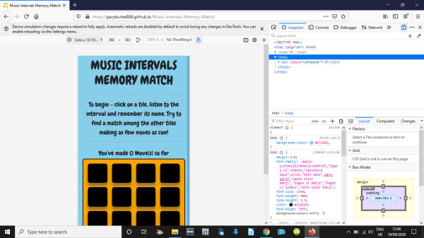

### Screen Sizes:

* Game is designed and optimised for use on phones and tablets. It is responsive on both and displays as expected on both, specifically in portrait orientation, where the full gameboard is visible at one time. Real world tested on iPhone and iPad with additional checks using in-broswer mock-up's of other brands of phones and tablets (Samsung Galaxy, Surface Duo etc.).

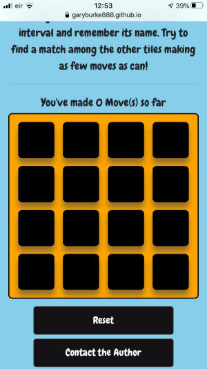

* Game displays well on large desktop screens but not on laptop screens where some of the gameboard is off-screen. This is something to be rectified in future versions if the game is to be available online and not just as an app.

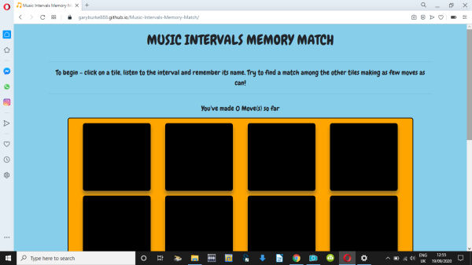

### Real World User Tests:

* __Katie (Music Teacher)__ - "Game is quick and easy to understand and play. I used an iPad to play it myself and then with a student. This game would be a helpful tool in teaching music theory or could just be a fun break during a lesson. More levels, with other intervals would be great. I would use this again and again."
* __Molly (10yr old Student)__ - "It's Fun! I played and tried to hum the notes as I pressed the buttons. I played it a few times and got better. I would play this again and my brother likes it too."

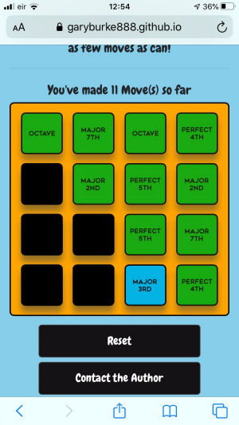
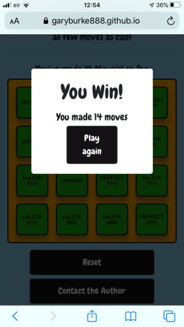

### Jasmine Testing

* 3 passing tests implemented using Jasmine, view [here](testing.html).
* __Test 1__ - Move counter should be zero at the start of the game. (Passed)
* __Test 2__ - All tiles should be 'closed' at the start of the game (titles not visible to user), therefore the 'opened tiles' array should be empty at the start of the game. (Passed)
* __Test 3__ - Check to see if the 'Youwin' modal is present at the start of the game. (Passed)

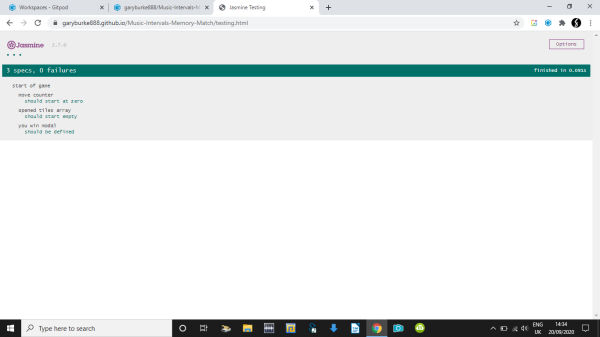

### Audio Testing

* Audio files for the tiles play as expected, upon clicking a tile.
* When a match is made, the second audio file does not play but a 'match' success audio file plays instead, which should give the user a feeling of success.
* Previous audio files caused distortion when overlapping if tiles were clicked in quick succession. To help with this their sound design was amended slightly and their volume was decreased, from inside each function.
* When the game is won a 'youwin' audio file plays to signify the end of the game, this overlaps any currently playing file but is in the same (major) key so should give the feeling of victory when the game is won.

### Contact Form Testing

* Contact form pops up as expected on all browsers and on all screen sizes.
* Contact form submits as expected, alert box appears as expected.
* Contact form does not refresh, so a 'back to game' button was added to allow the user to return to the game and play again.

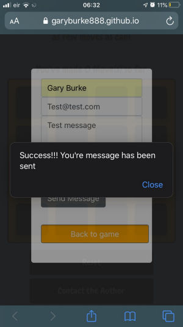

# DEPLOYMENT

* A new repository was created in GitHub.
* Game was developed using GitPod, committed to Git and pushed to GitHub.
* Game was deployed to GitHub Pages [here](https://garyburke888.github.io/Music-Intervals-Memory-Match/).

# FUTURE DEVELOPMENT PLANS

* Game could have more levels, where more difficult music intervals and other keys are introduced.
* Game could have a timer that either counts up (and stores the total time as well as number of moves for the user) or counts down adding pressure to the game play.
* Game could let users register a best score and then try to beat it by playing again.
* Game could have beginner / inter / advanced levels.
* The ability to change the sounds (from guitar to piano or bells etc.) could be offered to the user.

# CREDITS & ACKNOWLEDGEMENTS

* [Tutorial](https://scotch.io/tutorials/how-to-build-a-memory-matching-game-in-javascript)
* [Jasmine Testing](https://jasmine.github.io/2.0/introduction)
* Testing, design & development ideas - Code Institute
* Gerard McBride - Mentor
* Gary Burke - Designer